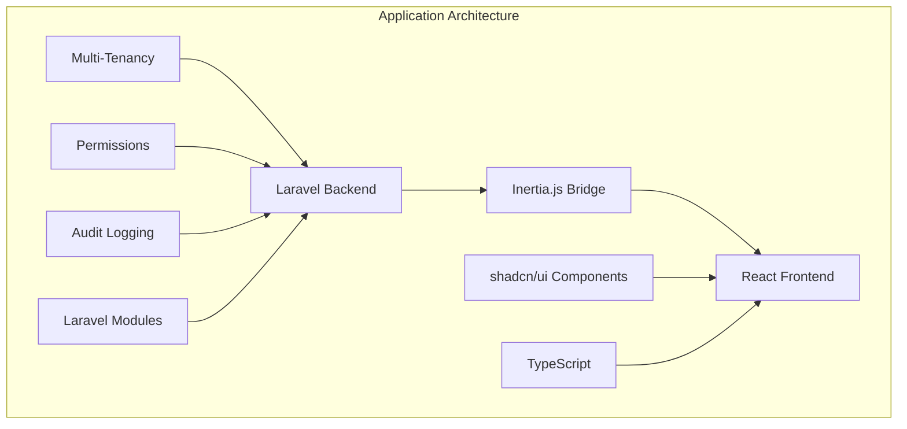

# Development Guide

Welcome to the MyXFin development guide! This section provides comprehensive documentation and tools for developing new features and modules within the MyXFin application.

## 📚 What You'll Find Here

### 📋 [Resource Module Guide](./resource-module-guide.md)

A complete step-by-step guide for creating new resource modules in MyXFin. This guide covers:

- **Backend Development**: Laravel modules, models, controllers, migrations
- **Frontend Development**: React components, forms, data tables, validation
- **Multi-tenancy Integration**: Company-scoped data and session management
- **Security Implementation**: Permission-based access control and authorization
- **Audit Logging**: Complete audit trail setup and configuration
- **Best Practices**: Coding standards and architectural patterns

### ✅ [Module Creation Checklist](./module-creation-checklist.md)

A practical checklist to ensure you follow all established patterns when creating new modules:

- **Pre-Development Planning**: Requirements analysis and architecture planning
- **Backend Implementation**: Step-by-step backend development tasks
- **Frontend Implementation**: React component and page development
- **Security & Permissions**: Authorization and access control setup
- **Testing & Validation**: Quality assurance and verification steps
- **Deployment**: Production deployment considerations

## 🏗️ Architecture Overview

MyXFin follows a modular architecture with these key components:



### Tech Stack

- **Backend**: Laravel 12 with modular architecture
- **Frontend**: React with Inertia.js, shadcn/ui, and Tailwind CSS
- **Authentication**: Laravel Starter Kit
- **Authorization**: Laravel Permissions (spatie/laravel-permission)
- **Audit Logging**: owen-it/laravel-auditing
- **Multi-tenancy**: stancl/tenancy with session-based switching
- **Modules**: nwidart/laravel-modules

## 🎯 Development Workflow

1. **Plan Your Module**

    - Define requirements and data structure
    - Plan permissions and user workflows
    - Design database schema

2. **Follow the Guide**

    - Use the [Resource Module Guide](./resource-module-guide.md) for implementation
    - Reference the [Module Creation Checklist](./module-creation-checklist.md) for completeness

3. **Validate Your Work**
    - Test functionality across different companies
    - Verify permissions and security
    - Ensure audit logging is working
    - Test responsive design and accessibility

## 🔧 Common Patterns

### Model Patterns

All models should follow these patterns:

- Extend base Model with `HasFactory`
- Use `BelongsToCompany` trait for multi-tenancy
- Implement `Auditable` interface for audit logging
- Define constants for types/categories/statuses
- Include query scopes for common filters
- Add helper methods for business logic

### Controller Patterns

All controllers should follow these patterns:

- Extend base Controller
- Use consistent pagination (15 items per page)
- Implement proper validation
- Add authorization checks
- Use database transactions for data integrity
- Return proper Inertia responses

### Frontend Patterns

All React components should follow these patterns:

- Use TypeScript for type safety
- Implement proper form validation with Zod schemas
- Use `useStandardForm` hook for consistent behavior
- Follow shadcn/ui component patterns
- Implement proper loading and error states
- Use consistent breadcrumb navigation

## 🛠️ Development Tools

### Quick Commands

```bash
# Generate new module
php artisan module:make ModuleName

# Create migration
php artisan module:make-migration create_table_name ModuleName

# Run module migrations
php artisan module:migrate ModuleName

# Build frontend
npm run build

# Start development server
npm run dev
```

### Code Quality

- TypeScript for type safety
- ESLint for code linting
- Prettier for code formatting
- Vite for fast development builds
- Tailwind CSS for styling

## 📖 Additional Resources

- [Laravel Documentation](https://laravel.com/docs)
- [React Documentation](https://react.dev/)
- [Inertia.js Documentation](https://inertiajs.com/)
- [shadcn/ui Documentation](https://ui.shadcn.com/)
- [Tailwind CSS Documentation](https://tailwindcss.com/)

## 🤝 Contributing

When contributing to MyXFin:

1. Follow the established patterns in this guide
2. Use the checklist to ensure completeness
3. Test thoroughly across different companies
4. Update documentation when adding new features
5. Follow the code style and conventions

## 🆘 Getting Help

If you need assistance:

1. Review the comprehensive guides in this section
2. Check existing modules for reference implementations
3. Consult the established patterns and best practices
4. Test your implementation thoroughly

Happy coding! 🚀
