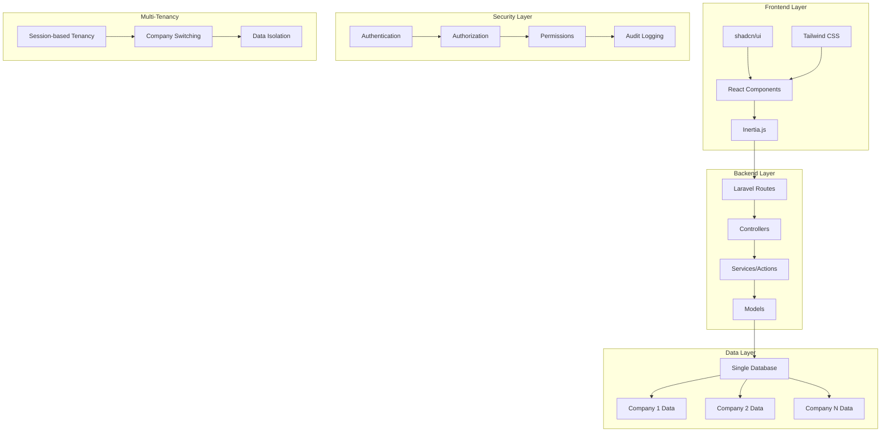

# Getting Started

Welcome to the MyXFin development documentation! This guide will help you understand our Laravel + Inertia.js + React application.

## Overview

MyXFin is a **multi-tenant financial management system** built with modern web technologies:

- **Backend**: Laravel 12 with Inertia.js
- **Frontend**: React with TypeScript
- **UI**: shadcn/ui components + Tailwind CSS
- **Database**: MySQL/PostgreSQL (Single database, multi-tenant)
- **State Management**: Inertia.js (no separate API)
- **Architecture**: Modular monolith with clear separation of concerns

## Key Features

### 🏢 **Multi-Tenancy (Multi-Company)**

- Users can manage multiple companies
- Company switching like QuickBooks/Xero
- Complete data isolation per company
- Session-based tenant identification

### 🔐 **Advanced Security**

- Role-based access control (RBAC)
- Permission-based navigation
- Single device login enforcement
- Comprehensive audit logging

### 📊 **Dynamic Admin Panel**

- Configurable sidebar navigation
- Permission-based menu visibility
- Role and permission management
- Real-time audit trails

### 🧩 **Modular Architecture**

- Laravel Modules for feature organization
- Scalable, maintainable codebase
- Clear separation of concerns
- Ready for enterprise scaling

## Architecture Overview



## Tech Stack Deep Dive

### **Backend Technologies**

- **Laravel 12**: Main framework
- **Inertia.js**: SPA-like experience without API complexity
- **spatie/laravel-permission**: Role-based access control
- **owen-it/laravel-auditing**: Comprehensive audit trails
- **stancl/tenancy**: Multi-tenant architecture
- **nwidart/laravel-modules**: Modular organization

### **Frontend Technologies**

- **React 18**: UI library
- **TypeScript**: Type safety
- **shadcn/ui**: Component library
- **Tailwind CSS**: Utility-first styling
- **TanStack Table**: Advanced data tables
- **Lucide React**: Icon system

## Quick Start

1. **Clone and Install**

    ```bash
    git clone <repository-url>
    cd myxfin
    composer install
    npm install
    ```

2. **Environment Setup**

    ```bash
    cp .env.example .env
    php artisan key:generate
    php artisan migrate
    php artisan db:seed
    ```

3. **Development Servers**

    ```bash
    # Terminal 1: Laravel
    php artisan serve

    # Terminal 2: Frontend
    npm run dev

    # Terminal 3: Documentation
    npm run docs:dev

    # Terminal 4: Storybook
    npm run storybook
    ```

## Project Structure

```
myxfin/
├── app/
│   ├── Http/Controllers/       # Request handling
│   ├── Models/                # Data models
│   ├── Services/              # Business logic
│   ├── Traits/                # Reusable functionality
│   └── ...
├── Modules/                   # Feature modules
│   └── AccountingSetup/       # Chart of Accounts module
├── resources/js/
│   ├── components/            # Reusable React components
│   ├── pages/                # Route-specific components
│   ├── layouts/              # Layout components
│   └── types/                # TypeScript definitions
├── docs/                     # Documentation
└── stories/                  # Storybook stories
```

## Development Philosophy

### **Clean Architecture Principles**

- **Separation of concerns**: Each layer has a specific responsibility
- **Dependency inversion**: High-level modules don't depend on low-level modules
- **Single responsibility**: Each class/function has one reason to change
- **Open/closed principle**: Open for extension, closed for modification

### **Code Organization**

- **Controllers**: Handle HTTP requests, delegate to services
- **Services/Actions**: Contain business logic
- **Models**: Data access and relationships
- **Traits**: Shared functionality across models
- **Modules**: Feature-based organization

## Next Steps

- **[Architecture Guide](./architecture)** - Understand the system design
- **[Frontend Development](./frontend)** - React patterns and components
- **[Backend Development](./backend)** - Laravel patterns and services
- **[Multi-Tenancy Guide](./multi-tenancy)** - Company management
- **[Security Guide](./security)** - Authentication and authorization
- **[Components Demo](http://localhost:6006)** - Interactive component library

## Development Tools

- **[Storybook](http://localhost:6006)**: Component development and documentation
- **[Laravel Telescope](http://localhost:8000/telescope)**: Application debugging
- **[Laravel Horizon](http://localhost:8000/horizon)**: Queue monitoring
- **PHPStan**: Static analysis
- **Prettier**: Code formatting
