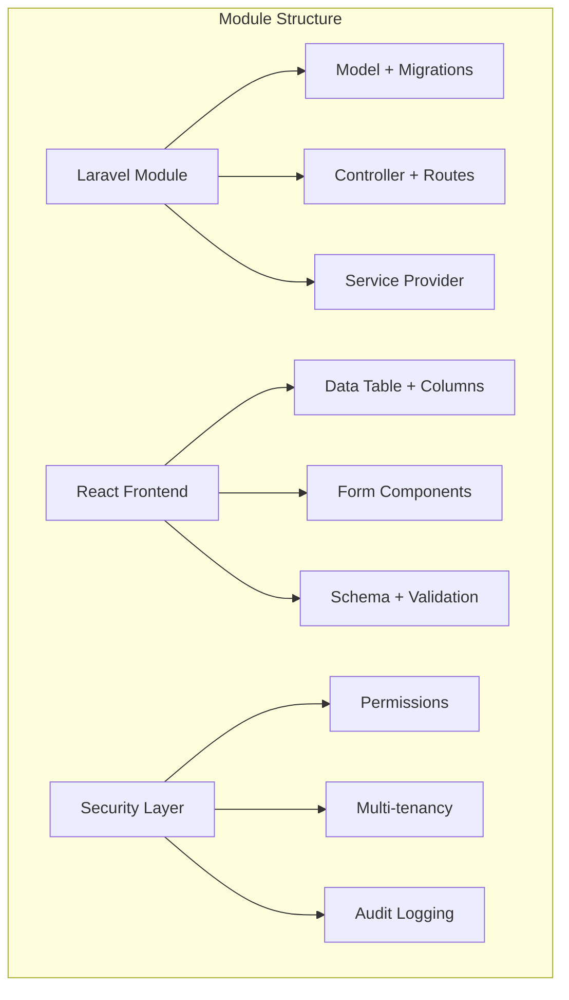

# Creating Resource Modules: Complete Guide

This comprehensive guide demonstrates how to create a complete resource module in the MyXFin application, using the Chart of Accounts module as a reference example.

## Overview

A resource module in MyXFin includes:

- **Backend**: Laravel module with models, controllers, migrations
- **Frontend**: React components with standardized forms and data tables
- **Multi-tenancy**: Company-scoped data isolation
- **Security**: Permission-based access control
- **Audit**: Complete audit trail logging
- **UI/UX**: Consistent design patterns using shadcn/ui

## Module Architecture



## Step 1: Generate Laravel Module

First, create a new Laravel module using nwidart/laravel-modules:

```bash
# Generate new module
php artisan module:make ModuleName

# Example: For Inventory module
php artisan module:make Inventory
```

This creates the basic module structure:

```
Modules/Inventory/
├── app/
│   ├── Http/Controllers/
│   └── Providers/
├── config/
├── database/
│   ├── factories/
│   ├── migrations/
│   └── seeders/
├── resources/
│   ├── assets/
│   └── views/
├── routes/
│   ├── api.php
│   └── web.php
├── tests/
├── composer.json
├── module.json
├── package.json
└── vite.config.js
```

## Step 2: Create the Model

Create your main resource model with multi-tenancy and audit support:

```php
<?php
// Modules/Inventory/app/Models/Product.php

namespace Modules\Inventory\Models;

use App\Traits\BelongsToCompany;
use Illuminate\Database\Eloquent\Builder;
use Illuminate\Database\Eloquent\Factories\HasFactory;
use Illuminate\Database\Eloquent\Model;
use Illuminate\Database\Eloquent\Relations\BelongsTo;
use Illuminate\Database\Eloquent\Relations\HasMany;
use OwenIt\Auditing\Contracts\Auditable;
use OwenIt\Auditing\Auditable as AuditableTrait;

class Product extends Model implements Auditable
{
    use HasFactory, BelongsToCompany, AuditableTrait;

    // Constants for product types/categories
    public const TYPE_PHYSICAL = 'PHYSICAL';
    public const TYPE_SERVICE = 'SERVICE';
    public const TYPE_DIGITAL = 'DIGITAL';

    public const STATUS_ACTIVE = 'ACTIVE';
    public const STATUS_INACTIVE = 'INACTIVE';
    public const STATUS_DISCONTINUED = 'DISCONTINUED';

    // Define sortable columns for DataTable
    public const SORTABLE_COLUMNS = [
        'product_code',
        'product_name',
        'product_type',
        'status',
        'unit_price',
        'stock_quantity',
        'created_at',
        'updated_at'
    ];

    /**
     * Attributes to include in the Audit.
     */
    protected $auditInclude = [
        'product_code',
        'product_name',
        'product_type',
        'description',
        'unit_price',
        'cost_price',
        'stock_quantity',
        'reorder_level',
        'status',
        'category_id',
    ];

    /**
     * Generating tags for each model audited.
     */
    public function generateTags(): array
    {
        return ['product', 'inventory'];
    }

    protected $fillable = [
        'company_id',
        'product_code',
        'product_name',
        'product_type',
        'description',
        'unit_price',
        'cost_price',
        'stock_quantity',
        'reorder_level',
        'status',
        'category_id',
    ];

    protected $casts = [
        'unit_price' => 'decimal:2',
        'cost_price' => 'decimal:2',
        'stock_quantity' => 'integer',
        'reorder_level' => 'integer',
    ];

    // Relationships
    public function category(): BelongsTo
    {
        return $this->belongsTo(ProductCategory::class);
    }

    // Scopes
    public function scopeActive(Builder $query): Builder
    {
        return $query->where('status', self::STATUS_ACTIVE);
    }

    public function scopeByType(Builder $query, string $type): Builder
    {
        return $query->where('product_type', $type);
    }

    public function scopeSearch(Builder $query, ?string $search): Builder
    {
        if (empty($search)) {
            return $query;
        }

        return $query->where(function (Builder $q) use ($search) {
            $q->where('product_code', 'like', "%{$search}%")
              ->orWhere('product_name', 'like', "%{$search}%")
              ->orWhere('description', 'like', "%{$search}%");
        });
    }

    // Helper Methods
    public function isActive(): bool
    {
        return $this->status === self::STATUS_ACTIVE;
    }

    public function needsReorder(): bool
    {
        return $this->stock_quantity <= $this->reorder_level;
    }

    public static function getAvailableTypes(): array
    {
        return [
            self::TYPE_PHYSICAL,
            self::TYPE_SERVICE,
            self::TYPE_DIGITAL,
        ];
    }

    public static function getAvailableStatuses(): array
    {
        return [
            self::STATUS_ACTIVE,
            self::STATUS_INACTIVE,
            self::STATUS_DISCONTINUED,
        ];
    }

    /**
     * Create a new factory instance for the model.
     */
    protected static function newFactory()
    {
        return \Modules\Inventory\Database\Factories\ProductFactory::new();
    }
}
```

## Step 3: Create Migration

Create the database migration:

```bash
php artisan module:make-migration create_products_table Inventory
```

```php
<?php
// Modules/Inventory/database/migrations/xxxx_create_products_table.php

use Illuminate\Database\Migrations\Migration;
use Illuminate\Database\Schema\Blueprint;
use Illuminate\Support\Facades\Schema;

return new class extends Migration
{
    public function up(): void
    {
        Schema::create('products', function (Blueprint $table) {
            $table->id();
            $table->foreignId('company_id')->constrained()->cascadeOnDelete();
            $table->string('product_code')->unique();
            $table->string('product_name');
            $table->enum('product_type', ['PHYSICAL', 'SERVICE', 'DIGITAL']);
            $table->text('description')->nullable();
            $table->decimal('unit_price', 10, 2)->default(0);
            $table->decimal('cost_price', 10, 2)->default(0);
            $table->integer('stock_quantity')->default(0);
            $table->integer('reorder_level')->default(0);
            $table->enum('status', ['ACTIVE', 'INACTIVE', 'DISCONTINUED'])->default('ACTIVE');
            $table->foreignId('category_id')->nullable()->constrained('product_categories');
            $table->timestamps();

            // Indexes
            $table->index(['company_id', 'status']);
            $table->index(['company_id', 'product_type']);
            $table->unique(['company_id', 'product_code']);
        });
    }

    public function down(): void
    {
        Schema::dropIfExists('products');
    }
};
```

## Step 4: Create Controller

Create a resource controller following the established patterns:

```php
<?php
// Modules/Inventory/app/Http/Controllers/ProductController.php

namespace Modules\Inventory\Http\Controllers;

use App\Http\Controllers\Controller;
use Illuminate\Http\RedirectResponse;
use Illuminate\Http\Request;
use Inertia\Inertia;
use Inertia\Response;
use Modules\Inventory\Models\Product;

class ProductController extends Controller
{
    public function index(Request $request): Response
    {
        $search = $request->get('search');
        $sortBy = $request->get('sort', 'product_code');
        $sortOrder = $request->get('order', 'asc');

        // Validate sort column
        if (!in_array($sortBy, Product::SORTABLE_COLUMNS)) {
            $sortBy = 'product_code';
        }

        $products = Product::with(['category'])
            ->search($search)
            ->orderBy($sortBy, $sortOrder)
            ->paginate(15)
            ->withQueryString();

        return Inertia::render('inventory/products/index', [
            'products' => $products,
            'filters' => [
                'search' => $search,
                'sort' => $sortBy,
                'order' => $sortOrder,
            ],
        ]);
    }

    public function create(): Response
    {
        return Inertia::render('inventory/products/create', [
            'types' => Product::getAvailableTypes(),
            'statuses' => Product::getAvailableStatuses(),
        ]);
    }

    public function store(Request $request): RedirectResponse
    {
        $validated = $request->validate([
            'product_code' => 'required|string|unique:products,product_code,NULL,id,company_id,' . tenant('id'),
            'product_name' => 'required|string|max:255',
            'product_type' => 'required|in:' . implode(',', Product::getAvailableTypes()),
            'description' => 'nullable|string',
            'unit_price' => 'required|numeric|min:0',
            'cost_price' => 'required|numeric|min:0',
            'stock_quantity' => 'required|integer|min:0',
            'reorder_level' => 'required|integer|min:0',
            'status' => 'required|in:' . implode(',', Product::getAvailableStatuses()),
        ]);

        Product::create($validated);

        return to_route('inventory.products.index')
            ->with('success', 'Product created successfully.');
    }

    public function show(Product $product): Response
    {
        $product->load(['category']);

        return Inertia::render('inventory/products/show', [
            'product' => $product,
        ]);
    }

    public function edit(Product $product): Response
    {
        return Inertia::render('inventory/products/edit', [
            'product' => $product,
            'types' => Product::getAvailableTypes(),
            'statuses' => Product::getAvailableStatuses(),
        ]);
    }

    public function update(Request $request, Product $product): RedirectResponse
    {
        $validated = $request->validate([
            'product_code' => 'required|string|unique:products,product_code,' . $product->id . ',id,company_id,' . tenant('id'),
            'product_name' => 'required|string|max:255',
            'product_type' => 'required|in:' . implode(',', Product::getAvailableTypes()),
            'description' => 'nullable|string',
            'unit_price' => 'required|numeric|min:0',
            'cost_price' => 'required|numeric|min:0',
            'stock_quantity' => 'required|integer|min:0',
            'reorder_level' => 'required|integer|min:0',
            'status' => 'required|in:' . implode(',', Product::getAvailableStatuses()),
        ]);

        $product->update($validated);

        return to_route('inventory.products.index')
            ->with('success', 'Product updated successfully.');
    }

    public function destroy(Product $product): RedirectResponse
    {
        $product->delete();

        return to_route('inventory.products.index')
            ->with('success', 'Product deleted successfully.');
    }
}
```

## Step 5: Configure Routes

Update the module routes:

```php
<?php
// Modules/Inventory/routes/web.php

use Illuminate\Support\Facades\Route;
use Modules\Inventory\Http\Controllers\ProductController;
use App\Http\Middleware\InitializeTenancyBySession;

Route::middleware(['web', 'auth', InitializeTenancyBySession::class])
    ->group(function () {
        Route::middleware(['can:manage_inventory'])
            ->prefix('inventory')
            ->name('inventory.')
            ->group(function () {
                Route::resource('products', ProductController::class);
            });
    });
```

## Step 6: Create React Components

### Schema and Validation

Create the TypeScript schema for form validation:

```typescript
// resources/js/pages/inventory/products/components/schema.ts
import * as z from 'zod';

export const productSchema = z.object({
    product_code: z.string().min(1, 'Product code is required'),
    product_name: z.string().min(1, 'Product name is required'),
    product_type: z.enum(['PHYSICAL', 'SERVICE', 'DIGITAL'], {
        errorMap: () => ({ message: 'Please select a valid product type' }),
    }),
    description: z.string().optional(),
    unit_price: z.number().min(0, 'Unit price must be 0 or greater'),
    cost_price: z.number().min(0, 'Cost price must be 0 or greater'),
    stock_quantity: z.number().int().min(0, 'Stock quantity must be 0 or greater'),
    reorder_level: z.number().int().min(0, 'Reorder level must be 0 or greater'),
    status: z.enum(['ACTIVE', 'INACTIVE', 'DISCONTINUED'], {
        errorMap: () => ({ message: 'Please select a valid status' }),
    }),
});

export type FormData = z.infer<typeof productSchema>;

export function normalizeProductData(values: Partial<FormData>): FormData {
    return {
        product_code: values.product_code ?? '',
        product_name: values.product_name ?? '',
        product_type: values.product_type ?? 'PHYSICAL',
        description: values.description ?? '',
        unit_price: values.unit_price ?? 0,
        cost_price: values.cost_price ?? 0,
        stock_quantity: values.stock_quantity ?? 0,
        reorder_level: values.reorder_level ?? 0,
        status: values.status ?? 'ACTIVE',
    };
}
```

### Form Component

Create a reusable form component:

```tsx
// resources/js/pages/inventory/products/components/ProductForm.tsx
import { Button } from '@/components/ui/button';
import { Form, FormControl, FormField, FormItem, FormLabel, FormMessage } from '@/components/ui/form';
import { Input } from '@/components/ui/input';
import { Select, SelectContent, SelectItem, SelectTrigger, SelectValue } from '@/components/ui/select';
import { Textarea } from '@/components/ui/textarea';
import { useStandardForm } from '@/hooks/use-standard-form';
import { router } from '@inertiajs/react';
import { normalizeProductData, productSchema, type FormData } from './schema';

interface Props {
    defaultValues: Partial<FormData>;
    types: string[];
    statuses: string[];
    url: string;
    method: 'post' | 'put';
    onSuccess?: () => void;
    disabled?: boolean;
}

export function ProductForm({ defaultValues, types, statuses, url, method, onSuccess, disabled = false }: Props) {
    const normalizedDefaults = normalizeProductData(defaultValues);

    const form = useStandardForm({
        schema: productSchema,
        defaultValues: normalizedDefaults,
        url,
        method,
        onSuccess,
        successMessage: {
            create: 'Product created successfully',
            update: 'Product updated successfully',
        },
    });

    return (
        <Form {...form}>
            <form onSubmit={form.handleSubmit(form.submit)} className="space-y-6">
                <div className="grid grid-cols-1 gap-6 md:grid-cols-2">
                    {/* Product Code */}
                    <FormField
                        control={form.control}
                        name="product_code"
                        render={({ field }) => (
                            <FormItem>
                                <FormLabel>Product Code</FormLabel>
                                <FormControl>
                                    <Input placeholder="PRD001" {...field} disabled={disabled} />
                                </FormControl>
                                <FormMessage />
                            </FormItem>
                        )}
                    />

                    {/* Product Name */}
                    <FormField
                        control={form.control}
                        name="product_name"
                        render={({ field }) => (
                            <FormItem>
                                <FormLabel>Product Name</FormLabel>
                                <FormControl>
                                    <Input placeholder="Product Name" {...field} disabled={disabled} />
                                </FormControl>
                                <FormMessage />
                            </FormItem>
                        )}
                    />

                    {/* Product Type */}
                    <FormField
                        control={form.control}
                        name="product_type"
                        render={({ field }) => (
                            <FormItem>
                                <FormLabel>Product Type</FormLabel>
                                <Select onValueChange={field.onChange} defaultValue={field.value} disabled={disabled}>
                                    <FormControl>
                                        <SelectTrigger>
                                            <SelectValue placeholder="Select type" />
                                        </SelectTrigger>
                                    </FormControl>
                                    <SelectContent>
                                        {types.map((type) => (
                                            <SelectItem key={type} value={type}>
                                                {type}
                                            </SelectItem>
                                        ))}
                                    </SelectContent>
                                </Select>
                                <FormMessage />
                            </FormItem>
                        )}
                    />

                    {/* Status */}
                    <FormField
                        control={form.control}
                        name="status"
                        render={({ field }) => (
                            <FormItem>
                                <FormLabel>Status</FormLabel>
                                <Select onValueChange={field.onChange} defaultValue={field.value} disabled={disabled}>
                                    <FormControl>
                                        <SelectTrigger>
                                            <SelectValue placeholder="Select status" />
                                        </SelectTrigger>
                                    </FormControl>
                                    <SelectContent>
                                        {statuses.map((status) => (
                                            <SelectItem key={status} value={status}>
                                                {status}
                                            </SelectItem>
                                        ))}
                                    </SelectContent>
                                </Select>
                                <FormMessage />
                            </FormItem>
                        )}
                    />

                    {/* Unit Price */}
                    <FormField
                        control={form.control}
                        name="unit_price"
                        render={({ field }) => (
                            <FormItem>
                                <FormLabel>Unit Price</FormLabel>
                                <FormControl>
                                    <Input
                                        type="number"
                                        step="0.01"
                                        min="0"
                                        placeholder="0.00"
                                        {...field}
                                        onChange={(e) => field.onChange(parseFloat(e.target.value) || 0)}
                                        disabled={disabled}
                                    />
                                </FormControl>
                                <FormMessage />
                            </FormItem>
                        )}
                    />

                    {/* Cost Price */}
                    <FormField
                        control={form.control}
                        name="cost_price"
                        render={({ field }) => (
                            <FormItem>
                                <FormLabel>Cost Price</FormLabel>
                                <FormControl>
                                    <Input
                                        type="number"
                                        step="0.01"
                                        min="0"
                                        placeholder="0.00"
                                        {...field}
                                        onChange={(e) => field.onChange(parseFloat(e.target.value) || 0)}
                                        disabled={disabled}
                                    />
                                </FormControl>
                                <FormMessage />
                            </FormItem>
                        )}
                    />

                    {/* Stock Quantity */}
                    <FormField
                        control={form.control}
                        name="stock_quantity"
                        render={({ field }) => (
                            <FormItem>
                                <FormLabel>Stock Quantity</FormLabel>
                                <FormControl>
                                    <Input
                                        type="number"
                                        min="0"
                                        placeholder="0"
                                        {...field}
                                        onChange={(e) => field.onChange(parseInt(e.target.value) || 0)}
                                        disabled={disabled}
                                    />
                                </FormControl>
                                <FormMessage />
                            </FormItem>
                        )}
                    />

                    {/* Reorder Level */}
                    <FormField
                        control={form.control}
                        name="reorder_level"
                        render={({ field }) => (
                            <FormItem>
                                <FormLabel>Reorder Level</FormLabel>
                                <FormControl>
                                    <Input
                                        type="number"
                                        min="0"
                                        placeholder="0"
                                        {...field}
                                        onChange={(e) => field.onChange(parseInt(e.target.value) || 0)}
                                        disabled={disabled}
                                    />
                                </FormControl>
                                <FormMessage />
                            </FormItem>
                        )}
                    />
                </div>

                {/* Description */}
                <FormField
                    control={form.control}
                    name="description"
                    render={({ field }) => (
                        <FormItem>
                            <FormLabel>Description</FormLabel>
                            <FormControl>
                                <Textarea placeholder="Product description..." className="resize-none" {...field} disabled={disabled} />
                            </FormControl>
                            <FormMessage />
                        </FormItem>
                    )}
                />

                <div className="flex justify-end space-x-2">
                    <Button
                        type="button"
                        variant="outline"
                        onClick={() => router.get(route('inventory.products.index'))}
                        disabled={form.isSubmitting || disabled}
                    >
                        Cancel
                    </Button>
                    <Button type="submit" disabled={form.isSubmitting || disabled}>
                        {form.isSubmitting ? 'Processing...' : method === 'post' ? 'Create Product' : 'Update Product'}
                    </Button>
                </div>
            </form>
        </Form>
    );
}
```

### Data Table Columns

Create the data table columns:

```tsx
// resources/js/pages/inventory/products/components/columns.tsx
'use client';

import { useDeleteConfirmation } from '@/components/data-table';
import { Badge } from '@/components/ui/badge';
import { Button } from '@/components/ui/button';
import { DropdownMenu, DropdownMenuContent, DropdownMenuItem, DropdownMenuTrigger } from '@/components/ui/dropdown-menu';
import { Link, router } from '@inertiajs/react';
import { ColumnDef } from '@tanstack/react-table';
import { ArrowUpDown, MoreHorizontal } from 'lucide-react';
import { toast } from 'sonner';

export interface Product {
    id: number;
    product_code: string;
    product_name: string;
    product_type: string;
    unit_price: number;
    stock_quantity: number;
    status: string;
}

export const productColumns: ColumnDef<Product>[] = [
    {
        accessorKey: 'product_code',
        header: ({ column }) => (
            <Button variant="ghost" onClick={() => column.toggleSorting(column.getIsSorted() === 'asc')}>
                Product Code
                <ArrowUpDown className="ml-2 h-4 w-4" />
            </Button>
        ),
        cell: ({ row }) => <div className="font-medium">{row.getValue('product_code')}</div>,
    },
    {
        accessorKey: 'product_name',
        header: ({ column }) => (
            <Button variant="ghost" onClick={() => column.toggleSorting(column.getIsSorted() === 'asc')}>
                Product Name
                <ArrowUpDown className="ml-2 h-4 w-4" />
            </Button>
        ),
        cell: ({ row }) => <div>{row.getValue('product_name')}</div>,
    },
    {
        accessorKey: 'product_type',
        header: 'Type',
        cell: ({ row }) => {
            const type = row.getValue('product_type') as string;
            return <Badge variant={type === 'PHYSICAL' ? 'default' : type === 'SERVICE' ? 'secondary' : 'outline'}>{type}</Badge>;
        },
    },
    {
        accessorKey: 'unit_price',
        header: ({ column }) => (
            <Button variant="ghost" onClick={() => column.toggleSorting(column.getIsSorted() === 'asc')}>
                Unit Price
                <ArrowUpDown className="ml-2 h-4 w-4" />
            </Button>
        ),
        cell: ({ row }) => {
            const price = parseFloat(row.getValue('unit_price'));
            return <div className="text-right font-medium">${price.toFixed(2)}</div>;
        },
    },
    {
        accessorKey: 'stock_quantity',
        header: ({ column }) => (
            <Button variant="ghost" onClick={() => column.toggleSorting(column.getIsSorted() === 'asc')}>
                Stock
                <ArrowUpDown className="ml-2 h-4 w-4" />
            </Button>
        ),
        cell: ({ row }) => <div className="text-right">{row.getValue('stock_quantity')}</div>,
    },
    {
        accessorKey: 'status',
        header: 'Status',
        cell: ({ row }) => {
            const status = row.getValue('status') as string;
            return <Badge variant={status === 'ACTIVE' ? 'default' : status === 'INACTIVE' ? 'secondary' : 'destructive'}>{status}</Badge>;
        },
    },
    {
        id: 'actions',
        enableHiding: false,
        cell: ({ row }) => {
            const product = row.original;
            const { confirmDelete } = useDeleteConfirmation();

            const handleDelete = () => {
                const deleteAction = () => {
                    router.delete(route('inventory.products.destroy', product.id), {
                        onSuccess: () => {
                            toast.success('Product deleted successfully');
                        },
                        onError: () => {
                            toast.error('Failed to delete product');
                        },
                    });
                };

                confirmDelete({
                    title: 'Delete Product',
                    description: `Are you sure you want to delete "${product.product_name}"? This action cannot be undone.`,
                    onConfirm: deleteAction,
                });
            };

            return (
                <DropdownMenu>
                    <DropdownMenuTrigger asChild>
                        <Button variant="ghost" className="h-8 w-8 p-0">
                            <span className="sr-only">Open menu</span>
                            <MoreHorizontal className="h-4 w-4" />
                        </Button>
                    </DropdownMenuTrigger>
                    <DropdownMenuContent align="end">
                        <DropdownMenuItem asChild>
                            <Link href={route('inventory.products.show', product.id)}>View</Link>
                        </DropdownMenuItem>
                        <DropdownMenuItem asChild>
                            <Link href={route('inventory.products.edit', product.id)}>Edit</Link>
                        </DropdownMenuItem>
                        <DropdownMenuItem onClick={handleDelete} className="text-red-600">
                            Delete
                        </DropdownMenuItem>
                    </DropdownMenuContent>
                </DropdownMenu>
            );
        },
    },
];
```

## Step 7: Create Page Components

### Index Page

```tsx
// resources/js/pages/inventory/products/index.tsx
import { DataTable } from '@/components/data-table';
import { Button } from '@/components/ui/button';
import { Card, CardContent, CardDescription, CardHeader, CardTitle } from '@/components/ui/card';
import AppLayout from '@/layouts/app-layout';
import { type BreadcrumbItem, type LaravelPaginator, type PageProps } from '@/types';
import { Head, Link } from '@inertiajs/react';
import { productColumns, type Product } from './components/columns';

interface ProductsPageProps extends PageProps {
    products: LaravelPaginator<Product>;
    filters?: {
        search?: string;
        sort?: string;
        order?: string;
    };
}

const BREADCRUMBS: BreadcrumbItem[] = [
    { title: 'Inventory', href: '#' },
    { title: 'Products', href: route('inventory.products.index') },
];

export default function ProductsIndex({ products, filters }: ProductsPageProps) {
    return (
        <AppLayout breadcrumbs={BREADCRUMBS}>
            <Head title="Products" />

            <div className="flex h-full flex-1 flex-col gap-4 p-4 md:gap-8 md:p-8">
                <Card>
                    <CardHeader className="flex flex-row items-center justify-between space-y-0 pb-4">
                        <div>
                            <CardTitle>Products</CardTitle>
                            <CardDescription>Manage your product inventory</CardDescription>
                        </div>
                        <Button asChild>
                            <Link href={route('inventory.products.create')}>Add Product</Link>
                        </Button>
                    </CardHeader>
                    <CardContent>
                        <DataTable
                            columns={productColumns}
                            data={products.data}
                            pagination={products}
                            searchable
                            searchPlaceholder="Search products..."
                            filters={filters}
                        />
                    </CardContent>
                </Card>
            </div>
        </AppLayout>
    );
}
```

### Create Page

```tsx
// resources/js/pages/inventory/products/create.tsx
import { Card, CardContent, CardDescription, CardHeader, CardTitle } from '@/components/ui/card';
import AppLayout from '@/layouts/app-layout';
import { BreadcrumbItem, PageProps } from '@/types';
import { Head } from '@inertiajs/react';
import { ProductForm } from './components/ProductForm';

interface CreateProductProps extends PageProps {
    types: string[];
    statuses: string[];
}

const breadcrumbs: BreadcrumbItem[] = [
    { title: 'Inventory', href: '#' },
    { title: 'Products', href: route('inventory.products.index') },
    { title: 'Create', href: route('inventory.products.create') },
];

export default function CreateProduct({ types, statuses }: CreateProductProps) {
    const defaultValues = {
        product_code: '',
        product_name: '',
        product_type: 'PHYSICAL',
        description: '',
        unit_price: 0,
        cost_price: 0,
        stock_quantity: 0,
        reorder_level: 0,
        status: 'ACTIVE',
    };

    return (
        <AppLayout breadcrumbs={breadcrumbs}>
            <Head title="Create Product" />
            <div className="flex h-full flex-1 flex-col gap-4 p-4 md:gap-8 md:p-8">
                <Card>
                    <CardHeader>
                        <CardTitle>Create Product</CardTitle>
                        <CardDescription>Add a new product to your inventory.</CardDescription>
                    </CardHeader>
                    <CardContent>
                        <ProductForm
                            defaultValues={defaultValues}
                            types={types}
                            statuses={statuses}
                            url={route('inventory.products.store')}
                            method="post"
                        />
                    </CardContent>
                </Card>
            </div>
        </AppLayout>
    );
}
```

## Step 8: Setup Permissions & Navigation

### Add Permissions

Add to your `database/seeders/PermissionSeeder.php`:

```php
Permission::create(['name' => 'manage_inventory']);
Permission::create(['name' => 'view_products']);
Permission::create(['name' => 'create_products']);
Permission::create(['name' => 'edit_products']);
Permission::create(['name' => 'delete_products']);
```

### Add Navigation Menu

Add to your navigation seeder or admin panel:

```php
MenuItem::create([
    'name' => 'Inventory',
    'route' => 'inventory.products.index',
    'icon' => 'Package',
    'permission_name' => 'manage_inventory',
    'type' => 'main',
    'order' => 30,
]);
```

## Step 9: Register the Module

Ensure your module is registered in `modules_statuses.json`:

```json
{
    "AccountingSetup": true,
    "Inventory": true
}
```

## Step 10: Run Migrations and Test

```bash
# Run the module migration
php artisan module:migrate Inventory

# Seed permissions if needed
php artisan db:seed --class=PermissionSeeder

# Clear caches
php artisan optimize:clear
```

## Best Practices Summary

### ✅ **Backend Standards**

- Use `BelongsToCompany` trait for multi-tenancy
- Implement `Auditable` interface for audit trails
- Follow consistent naming conventions
- Add proper validation and authorization
- Use scopes for query filtering

### ✅ **Frontend Standards**

- Use `useStandardForm` hook for forms
- Follow TypeScript schema patterns
- Implement consistent data table columns
- Use standardized breadcrumbs and layouts
- Apply proper error handling

### ✅ **Security Standards**

- Implement permission-based access control
- Use company-scoped queries
- Validate all inputs properly
- Add CSRF protection
- Implement proper authorization checks

### ✅ **UI/UX Standards**

- Use shadcn/ui components consistently
- Follow established design patterns
- Implement responsive layouts
- Add loading states and error handling
- Use consistent spacing and typography

This guide provides a complete blueprint for creating resource modules that integrate seamlessly with your MyXFin application architecture. Each new module you create following this pattern will be consistent, secure, and maintainable.
